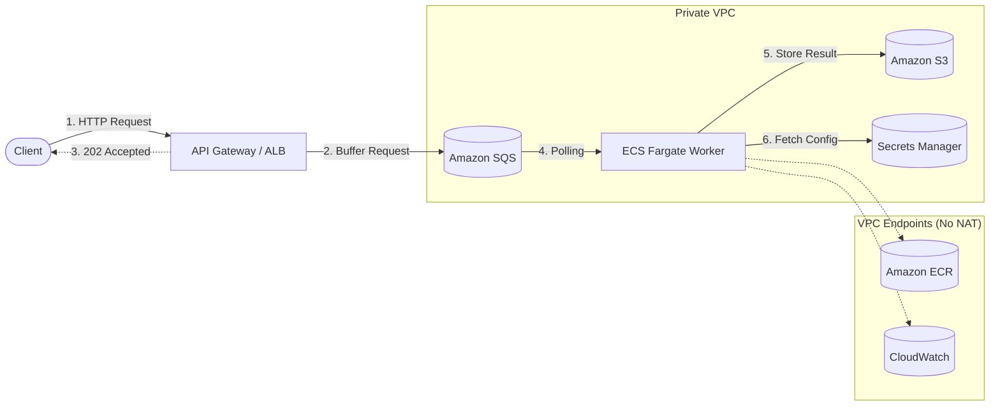

[](https://github.com/cvneren/async-AWS-python-backend/actions/workflows/ci.yml)


# Asynchronous Python Backend Infrastructure on AWS

## 1. Problem Statement and Solution

Modern enterprise Python workloads involving resource-intensive operations—such as machine learning inferences, complex data manipulation, or external API communications—often exceed the strict execution limits of synchronous request-response cycles.

**The Problem:**
* **Timeouts:** Relying on synchronous architectures introduces catastrophic risks, such as the strict Amazon API Gateway 29-second timeout.
* **Resource Exhaustion:** Long-running tasks lead to exhausted thread pools and socket timeouts.
* **Inefficiency:** Compute costs scale linearly with idle wait times while holding connections open.

**The Solution:**
* **Decoupling:** Fast acknowledgment (202 Accepted) at the edge, buffering the actual payload into an SQS queue.
* **Asynchronous Processing:** ECS Fargate scales based on queue depth to process the heavy tasks asynchronously in the background.
* **Reliability:** The message broker ensures high availability, deterministic compute performance, and absolute execution reliability for long-running tasks.

## 2. High-Level Architecture



## 3. Features at a Glance

* **Serverless Compute:** ECS Fargate bypasses the 15-minute execution limits of AWS Lambda and scales to zero. It utilizes Fargate Spot capacity providers to reduce compute costs by up to 70% for fault-tolerant asynchronous processing.
* **NAT-less Economics:** The architecture implements VPC Interface Endpoints (for ECR, SQS, CloudWatch, Secrets Manager) and Gateway Endpoints (for S3) to completely bypass costly Managed NAT Gateway data processing fees.
* **Zero-Trust IAM:** Strict adherence to the principle of least privilege. Includes distinct ECS Task Execution Roles and ECS Task Roles, using granular ARN-scoped policies with zero wildcard resource escalation.
* **Modern State Management:** Leverages Terraform 1.10.0+ native S3 optimistic locking (`use_lockfile = true`), collapsing the infrastructure dependency tree and eliminating the operational overhead of DynamoDB tables.

## 4. Repository Structure

The repository follows a strict modular layout, separating reusable infrastructure components from logically isolated environment roots.

```text
infrastructure-repo/
├── environments/
│   ├── development/
│   ├── staging/
│   └── production/
└── modules/
    ├── ecs-async-worker/
    ├── iam-security-roles/
    └── networking-core/
```

## 5. Local Execution and Development

### 5.1 Prerequisites
* **Terraform**: version `>= 1.10.0` (required for native S3 locking).
* **TFLint**: Required for static analysis and AWS ruleset validation.
* **AWS CLI**: Configured with appropriate credentials for target environment access.

### 5.2 Deployment Workflow
1. **Initialize the Environment**:
   Navigate to the target environment directory and initialize the backend.
   ```bash
   cd environments/development
   terraform init
   ```

2. **Validate Code Quality**:
   Run TFLint from the repository root to ensure compliance with architectural standards.
   ```bash
   tflint --recursive
   ```

3. **Plan and Apply**:
   Generate an execution plan and apply the infrastructure changes.
   ```bash
   terraform plan -out=tfplan
   terraform apply tfplan
   ```

## 6. Universal Resource Tagging
All resources are automatically tagged via the `aws_default_tags` provider block, ensuring consistent metadata propagation for cost center allocation, project ownership, and environment isolation.
